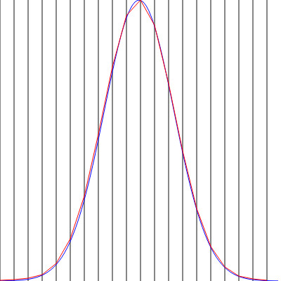

# draw2Sample
the interface for graphical sampling in order to generate values following an empirical distribution, with img/canvas tag on Firefox.  
https://github.com/YujiSODE/draw2Sample

>Copyright (c) 2016 Yuji SODE \<yuji.sode@gmail.com\>  
>This software is released under the MIT License.  
>See LICENSE or http://opensource.org/licenses/mit-license.php
______

##Concept
  
__Figure 1. Concept of graphical sampling.__ _f_ (_x_) is a graph drawn on graphical data (_W_ x _H_ px).

The sample (_Sp_) as a result of graphical sampling with graphical data: _W_ x _H_ px (Figure 1) can be expressed as follows:  
let graphical heights of _f_ (_x1_) and _f_ (_x2_) be _a1_ px and _a2_ px respectively,  
(1)   _Sp_ = _x0_, ..., _x1_, ..., _x1_, _x2_, ..., _x2_, ..., _xn_  
and  
(2)   _Sp_ = _x0_ \* _a0_, _x1_ \* _a1_, _x2_ \* _a2_, ..., _xn_ \* _an_  
RGBA color value in a pixel is available in order to recognize the shape of the graph.  
The alpha value is used in this program; a pixel where alpha > 0 is regarded as graph.

##Script
* draw2Sample.js
* \[v1.2+\] pValue.js

##How to generating values following a given distribution
1. __"Sample (_Sp_)":__ ["Rnd"](#output-data) in the result output of "draw2Sample.js"  
2. __Generating target values;__ the target values are obtained with bootstrap Method (Efron,1979) via _Sp_.
3. __\(Optional \[v1.2+\]\) Estimating p-value;__ p-value is estimated with "pValue.js" via _Sp_.

##How to use
* call "draw2Sample()" in a html file with img/canvas tag.
* \(Optional \[v1.2+\]\) call "_pValue()" of "pValue.js", in order to estimate p-value; (see [__Estimating p-value__](#optional-v12-estimating-p-value) for details of prameters).

1. __Selecting some target images__  
   __Target tag;__ here target images can be selected.  

2. __Draw graph__  
   __Drawing;__ a graph can be drawn on the newly created canvas tag freehand or with script (see [__"Example with the standard normal distribution"__](#example-with-the-standard-normal-distribution)).  
   "canvas id": the id of canvas tag to draw graph.  
   "Size": size of the selecting canvas tag, expressed with Width (W) and Height (H).

3. __Sampling__  
   The sampling from the given graph (2.) is run with __"Run sampling" button__, and the result output is shown in __"Result"__.  

   ####_Inputs and buttons_  
   * __"Target width":__ the target sampling area, expressed with left side x coordinate (x0) and width (w), shown in red.
   * __"Sampling interval";__ it sets how many times the given graph (2.) is sampled in a given target area, starting with x0.
   * __"Range of values":__ the true x-coordinate values in the target sampling area, expressed with left side (v0) and right side (v).
   * __"Clear image" button;__ it clears the selected image (1.), which is shown under the drawing layer.
   * __"Show sampling line" button;__ it shows "Sampling interval" as vertical lines.
   * __"Clear sampling line" button;__ it clears "Sampling interval" shown by __"Show sampling line" button__.
   * __"Clear drawing" button;__ it clears drawn graph (2.).
   * __"Run sampling" button;__ it runs sampling and outputs results into __"Result"__.
   * __"Close" button;__ it closes this interface.
   * __"Result";__ where results are output, and additional comments are also available here.
   * __"Clear result" button;__ it clears output results in __"Result"__.
   * __"Email address":__ email address used outputting __"Result"__ as email format.
   * __"Output as email" button;__ it saves the __"Result"__ as email to given address.

   ####_Output data_  
   * dataLog: csv formatted values expressed as _n_@_y_ for a _n_-th sampling result: _y_ with top left corner as origin.
   * x@f(x): csv formatted values expressed as _x_@_f_ (_x_) for a value of _f_ (_x_) at _x_ with bottom left as origin.
   * __Rnd:__ csv formatted values estimated as results of a sampling.

______
##\[v1.2+\] Estimating p-value

______
##Example with the standard normal distribution
###Script used for drawing graph
* stdNormDist100pt.js

###Sampling parameters
`/*Fri_Sep_09_2016_17:01:16_GMT+0900_(JST),Sampling interval:20,Size: W x H = 400 x 400 px*/`

  
__Figure 2. Sampling example with the standard normal distribution by script.__ Blue and red lines show a graph  
of the standard normal distribution by script and a recognized distribution respectively. Vertical lines show where  
sampled from blue graph.

###1-sample t-test
The sampled size by "draw2Sample.js": `<Sample size:2527>`

1. `[Resampled size:100;Given mean:0;Simulation:100times;Significance level:0.025]`  
   Result: `Rejection rate:0`
2. `[Resampled size:10;Given mean:0.0;Simulation:10000times;Significance level:0.025]`  
   Result: `Rejection rate:0.0163`
3. `[Resampled size:20;Given mean:0;Simulation:10000times;Significance level:0.025]`  
   Result: `Rejection rate:0.0146`

______
##Reference
* Efron, B. 1979. Bootstrap Methods: Another Look at the Jackknife. Ann. Statist. vol. 7, no. 1, p. 1-26.
